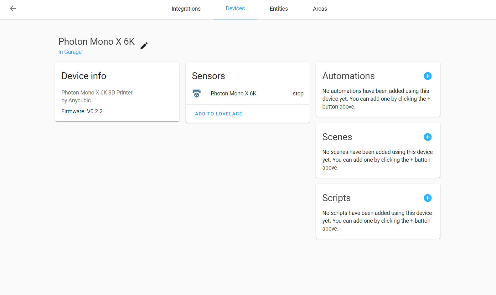
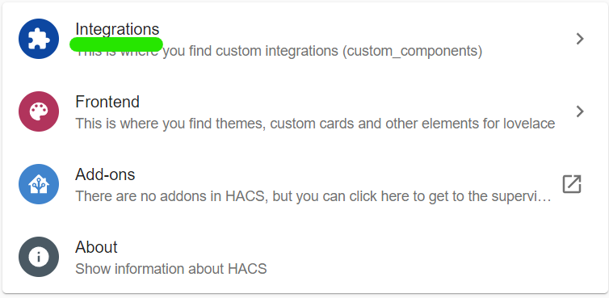
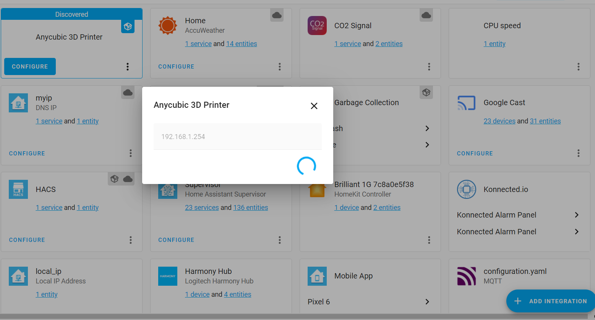
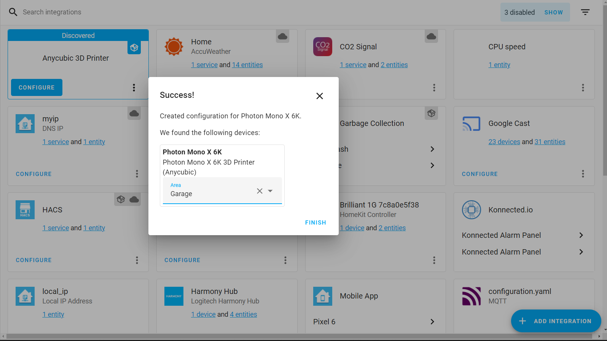

# About
This is a library to provide support for Mono X Printers.

# uart-wifi
the [uart-wifi](https://pypi.org/project/uart-wifi/) library can be downloaded from PyPI.  It contains required python tools for communicating with MonoX Printers. To install, simply install Python, then type `pip install uart-wifi`. After which, you can create fake printers and communicate with them.

## monox.py
A command line script to gather information from the Mono X printer.  This is tested working on the Anycubic Mono X 6k and should work on any Mono X or Mono SE printer.

    Usage: monox.py -i <ip address> -c <command>
    args:
     -i [--ipaddress=] - The IP address which your Anycubic Mono X can be reached

     -c [--command=] - The command to send.

    Commands may be used one-at-a-time. Only one command may be sent and it is expected to be in the format below.

    Command: getstatus - Returns a list of printer statuses.

    Command: getfile - returns a list of files in format <internal name>: <file name>.  When referring to the file via command, use the <internal name>.

    Command: sysinfo - returns Model, Firmware version, Serial Number, and wifi network.

    Command: getwifi - displays the current wifi network name.

    Command: gopause - pauses the current print.

    Command: goresume - ends the current print.

    Command: gostop,end - stops the current print.

    Command: delfile,<internal name>,end - deletes a file.

    Command: gethistory,end - gets the history and print settings
    of previous prints.

    Command: delhistory,end - deletes printing history.

    Command: goprint,<internal name>,end - Starts a print of the
    requested file

    Command: getPreview1,<internal name>,end - returns a list of dimensions used for the print.

## fake_printer.py
A command line script to simulate a MonoX 3D printer for testing purposes. You can simulate a fleet of Mono X 3D printers!

    Usage: fake_printer.py -i <ip address> -c <command>
    args:
     [-i, [--ipaddress=]] - The IP address which to acknowledge requests. This defaults to any or 0.0.0.0.

     [-p [--port=]] - The port to listen on. This defaults to 6000.
# Home Assistant Integration

## Features
Assign automations based on print/stop state:

Clean layout:
Extra detail when printing:
Automatic Discovery:

## Installation
To install, just add this repository to HACS.

The basic operation is simple. First you'll need to install [HACS](https://hacs.xyz/docs/setup/download). Then from within HACS click Integration

Select the menu from the top right, and click Custom repositories.

Add this repository

From within the same screen, click the Explore & Download Repositories button, and then type AnyCubic Pyhon to install. The process should be self-explanatory after this.

After installation, Home Assistant will requrie a reboot.  Upon reboot, device detection will occur.  Within your settings>Devices you should see a prompt for automatic discovery.  Click this to install.

